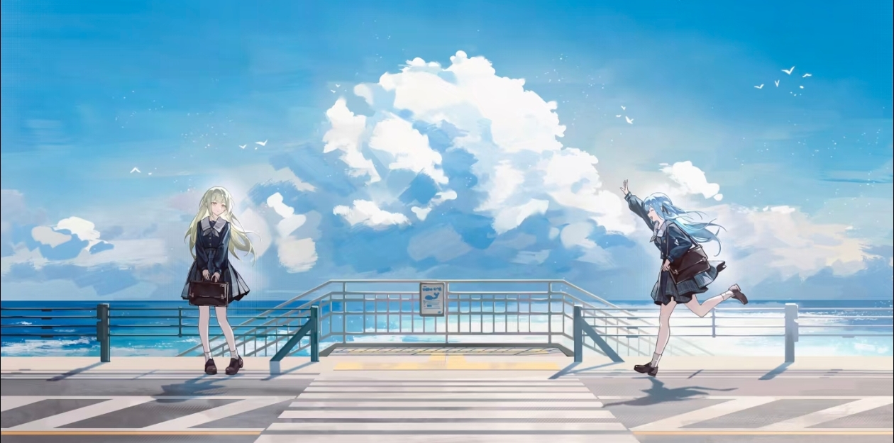

# 👋 Hi, I'm imagist13

## 🌿 About Me
- 🤖 Interested in **AI Agent & Full‑stack development**, currently diving deep into both fields
- 🌱 Love open source, keep learning and building practical projects
- 🦀 Exploring systems programming & big data ecosystem
- 🎐 Enjoy anime in spare time
- ✉️ Contact: ideast2025@gmail.com

## 🛠 Tech Stack

## 🔥 Streak

 

✨ Thanks for visiting ✨

